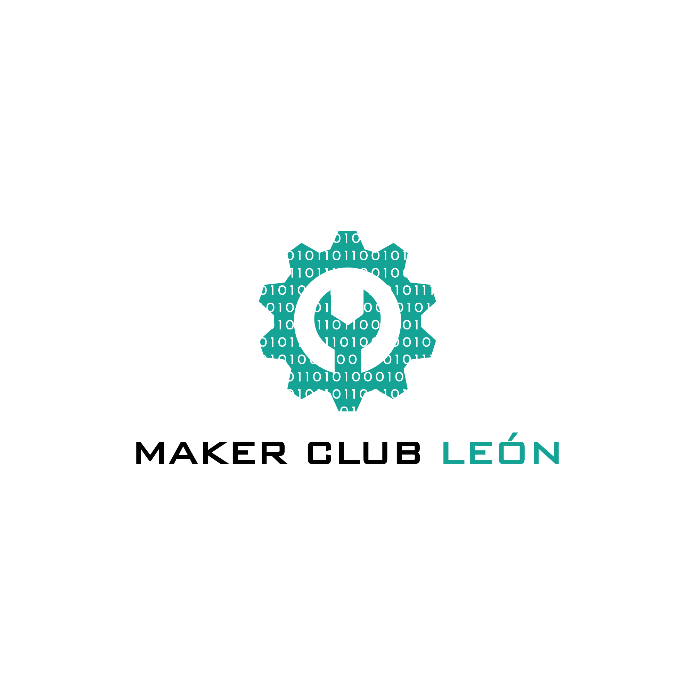

# Miscelánea 3D - Maker Club León

  

## 📖 Sobre este repositorio

¡Bienvenidos al repositorio de diseños 3D del **Maker Club León** (Asociación ligada a la Universidad de León)!

Este repositorio actúa como nuestro "cajón de sastre" oficial. Aquí centralizamos diseños, modificaciones (remixes), herramientas y piezas de repuesto creados por nuestros miembros que no forman parte de un proyecto principal, pero que queremos compartir con la comunidad.

## 📂 Estructura del Repositorio

Para facilitar la búsqueda, organizamos los archivos STL (y sus fuentes) en las siguientes categorías:

| Carpeta | Descripción |
| :--- | :--- |
| 🛠️ `/Herramientas` | Útiles de taller, jigs, organizadores, soportes para soldar, etc. |
| ⚙️ `/Repuestos` | Piezas de sustitución para máquinas, electrodomésticos o mobiliario. |
| 🖨️ `/Impresoras_3D` | Upgrades y mods para impresoras (Ender, Prusa, Voron, etc.). |
| 🎨 `/Decoracion` | Figuras, llaveros, merchandising y elementos estéticos. |
| 📷 `/Assets` | Fotografías o assets gráficos para el proyecto. |

## 🖨️ Recomendaciones Generales

Salvo que dentro de la carpeta del diseño haya un archivo `LEEME.txt` o `INFO.txt` con instrucciones específicas, sigue estas directrices:

* **Orientación:** Los STL se suben en la orientación óptima de impresión.
* **Archivos fuente:** Fomentamos el *Open Source*. Si ves un archivo `.step`, `.f3d` (Fusion 360) o `.fcstd` (FreeCAD), ¡descárgalo y modifícalo a tu gusto!

## 🤝 Cómo Contribuir

Si eres miembro del club y has diseñado algo útil:

1.  Haz un **Fork** de este repositorio.
2.  Crea una carpeta nueva dentro de la categoría adecuada. **Nombre de carpeta descriptivo** (ej: `Soporte-Auriculares-Mesa`).
3.  Sube tus archivos (STL + Fuente editable si es posible).
4.  (Opcional) Añade una foto del resultado real.
5.  Haz un **Pull Request** a la rama `main`.

## 📄 Licencia

Este trabajo está bajo una <a rel="license" href="http://creativecommons.org/licenses/by-sa/4.0/">Licencia Creative Commons Atribución-CompartirIgual 4.0 Internacional</a>.

Esto significa que puedes usar, imprimir y remixar nuestros diseños, siempre que:
1.  Cites al **Maker Club León**.
2.  Si modificas el diseño, lo compartas bajo esta misma licencia.

---

  Hecho con cariño y mucho filamento.
   
  <a href="https://www.makerclubleon.es">www.makerclubleon.es</a> • <a href="https://www.makerclubleon.com">www.makerclubleon.com</a>
   
   
  Encuéntranos pronto en:
   
  <a href="#">MakerWorld</a> • <a href="#">Printables</a>

